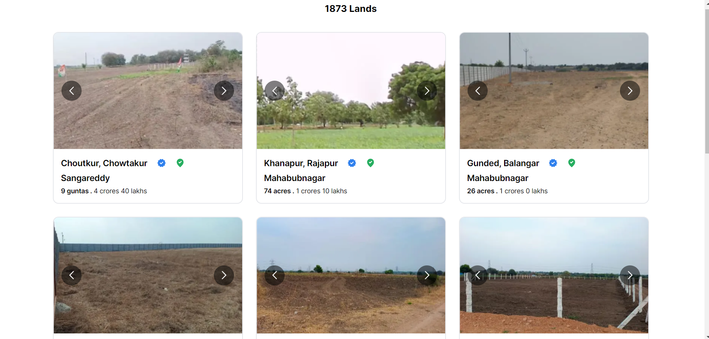

# 1acre assignment

This is a Next.js project that demonstrates implementing infinite scrolling with an API and a list of cards with carousel for images.

## Live link

[Click here](https://1acre.vercel.app/)

# Screenshots



## Description

This project fetches data from an API endpoint and displays it using infinite scrolling. It features a list of cards representing the land for sale, each containing a carousel for images. Users can scroll through the list to view more items, and the next page of data is loaded automatically when the user reaches the bottom of the page.

## Other Details
Tech Framework: This project is built with Next.js, tailwind css

## Getting Started

First, run the development server:

```bash
npm run dev
# or
yarn dev
# or
pnpm dev
# or
bun dev
```

Open [http://localhost:3000](http://localhost:3000) with your browser to see the result.

You can start editing the page by modifying `app/page.js`. The page auto-updates as you edit the file.


